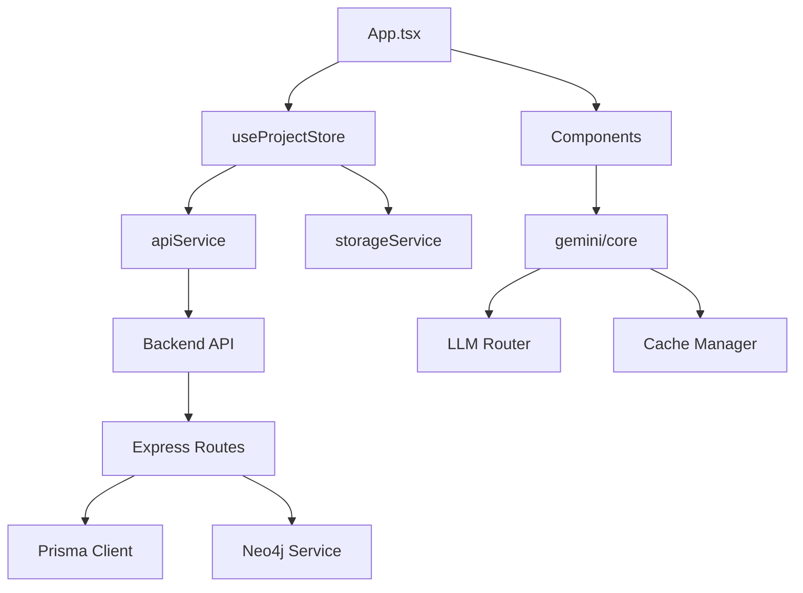

# Muse: 小说架构师 - 架构分析报告

> **分析日期**: 2026-03-21
> **分析人**: Chief Architect
> **项目版本**: 1.0.0

---

## 执行摘要

本报告对 **Muse: 小说架构师** 项目进行了全面的架构评估。该项目是一个基于 AI 的小说创作辅助工具,采用前后端分离架构,支持离线和在线两种工作模式。

**关键发现**:

- **架构成熟度高**: 项目采用了现代化的技术栈和良好的分层设计
- **数据层复杂**: 同时使用 IndexedDB/MySQL + Neo4j 图数据库,增加了系统复杂度
- **状态管理优秀**: 使用 Zustand 进行切片化订阅,性能优化到位
- **测试覆盖不足**: 仅有3个测试文件,测试覆盖率严重不足
- **代码规模适中**: 约114个 TypeScript 文件,代码组织清晰

---

## 一、技术栈评估

### 1.1 前端架构 (React + Zustand)

#### 优势

- **状态管理**: 使用 Zustand 替代 Redux,代码更简洁,性能更优
  - 支持切片化订阅,避免不必要的重渲染
  - `useProjectStore` 设计合理,状态分离清晰

- **组件化**: 组件按功能域划分 (WorldBuilder, CharacterCreator, PlotWeaver 等)
- **类型安全**: TypeScript 全覆盖,类型定义完整 (`types.ts`)
- **构建工具**: Vite 6 提供快速的开发体验

#### 问题

| 优先级 | 问题                | 影响                                                               | 建议                     |
| ------ | ------------------- | ------------------------------------------------------------------ | ------------------------ |
| **P1** | **大型组件文件**    | 部分组件过于庞大 (CharacterCreator.tsx 74KB, EchoChamber.tsx 42KB) | 拆分为更小的子组件       |
| **P2** | **类型定义集中**    | 所有类型定义在单一 `types.ts` 文件 (319行)                         | 按领域模块拆分类型文件   |
| **P2** | **缺少 API 层抽象** | API 调用分散在各组件中                                             | 统一使用 apiService 封装 |

### 1.2 后端架构 (Express + Prisma + Neo4j)

#### 优势

- **ORM 选型合理**: Prisma 提供类型安全的数据库操作
- **图数据库集成**: Neo4j 用于知识图谱,支持复杂关系查询
- **RESTful API**: 路由设计清晰,符合 REST 规范

#### 问题

| 优先级 | 问题                  | 影响                                                                          | 建议                                       |
| ------ | --------------------- | ----------------------------------------------------------------------------- | ------------------------------------------ |
| **P0** | **数据库选型矛盾**    | 使用 MySQL 存储文档型数据 (chapters, characters),应使用 PostgreSQL 或 MongoDB | 评估迁移到 PostgreSQL 或使用 JSON 字段优化 |
| **P1** | **缺少服务层抽象**    | 路由文件直接调用 neo4jService                                                 | 引入 Service 层解耦                        |
| **P1** | **缺少事务管理**      | 复杂操作无事务保护                                                            | 在 Prisma 中添加事务支持                   |
| **P2** | **缺少 API 版本控制** | 所有路由在 `/api/` 下                                                         | 引入 `/api/v1/` 版本前缀                   |

### 1.3 AI 服务集成

#### 优势

- **多模型支持**: Gemini + GLM 双模型路由
- **任务级模型覆盖**: 支持按任务类型指定模型
- **缓存机制**: 实现了 AI 响应缓存

#### 问题

| 优先级 | 问题                   | 影响                               | 建议                              |
| ------ | ---------------------- | ---------------------------------- | --------------------------------- |
| **P1** | **API Key 硬编码风险** | `process.env.API_KEY` 作为后备方案 | 强制要求用户配置,移除环境变量后备 |
| **P2** | **缺少速率限制**       | 无 LLM API 调用速率限制            | 实现令牌桶或滑动窗口限流          |
| **P2** | **错误重试逻辑简单**   | 仅重试 503/429/500 错误            | 增加更细粒度的错误处理策略        |

---

## 二、代码组织分析

### 2.1 目录结构

```
project/
├── components/          # React 组件 (约 40+ 个文件)
│   ├── ChapterOutliner/
│   ├── DraftingRoom/
│   ├── Echo/
│   ├── PlotWeaver/
│   ├── SettingsPanel/
│   └── panels/
├── services/            # 业务逻辑服务
│   ├── gemini/         # Gemini AI 服务
│   ├── apiService.ts   # 后端 API 封装
│   ├── cacheManager.ts # 缓存管理
│   └── schemas.ts      # Zod 验证模式
├── store/              # Zustand 状态管理
├── config/             # 配置文件
├── hooks/              # React Hooks
├── utils/              # 工具函数
└── server/             # 后端服务
    ├── src/
    │   ├── routes/    # API 路由
    │   └── services/  # 后端服务
    └── prisma/        # 数据库模式
```

#### 评价

- **清晰的功能域划分**: 组件按业务模块组织
- **关注点分离**: 前端组件/服务/状态分离良好
- **前后端分离**: server 目录独立,可单独部署

### 2.2 模块依赖关系



#### 问题

| 优先级 | 问题             | 影响                                                                                    | 建议                      |
| ------ | ---------------- | --------------------------------------------------------------------------------------- | ------------------------- |
| **P1** | **循环依赖风险** | gemini/core 导入 useProjectStore,而 useProjectStore 导入 gemini/core (clearConfigCache) | 重构配置管理,使用依赖注入 |
| **P2** | **服务层耦合**   | apiService 直接依赖 types.ts,应依赖接口                                                 | 引入接口抽象层            |

---

## 三、设计模式评估

### 3.1 状态管理模式

**当前方案**: Zustand with sliced subscriptions

```typescript
// 优秀的切片化订阅示例
const project = useProjectStore((state) => state.project);
const activeSection = useProjectStore((state) => state.activeSection);
```

**优势**:

- 避免了 prop drilling
- 细粒度订阅控制重渲染
- DevTools 支持良好

**问题**:
| 优先级 | 问题 | 建议 |
|--------|------|------|
| **P1** | **Store 职责过重** | `useProjectStore` 包含 30+ 个方法,应拆分为多个专用 Store |
| **P2** | **缺少状态持久化策略** | 仅依赖 storageService,无统一持久化中间件 | 考虑 Zustand persist 中间件 |

### 3.2 API 设计

**RESTful 评估**:

| 端点                         | 方法 | RESTful | 评价                    |
| ---------------------------- | ---- | ------- | ----------------------- |
| `/api/projects`              | GET  | ✅      | 获取项目列表            |
| `/api/projects/:id`          | GET  | ✅      | 获取单个项目            |
| `/api/projects/:id/full`     | PUT  | ⚠️      | 应使用 PATCH 或标准 PUT |
| `/api/graph/:projectId`      | GET  | ✅      | 获取图谱                |
| `/api/graph/:projectId/sync` | POST | ⚠️      | 应为 PUT 或使用 Webhook |

**问题**:

- 部分端点不符合 REST 语义
- 缺少 HATEOAS 支持
- 无 API 文档 (OpenAPI/Swagger)

### 3.3 组件复用

**复用程度**: 中等

**可复用组件**:

- `ErrorBoundary` - 错误边界
- `Loader` - 加载指示器
- `MarkdownRenderer` - Markdown 渲染
- `VirtualList` - 虚拟滚动列表

**问题**:

- 大量组件内联样式,未提取为通用 UI 组件库
- 缺少 Design System (Button, Input, Modal 等)

---

## 四、可扩展性分析

### 4.1 添加新功能的难度

**示例**: 添加新的 "Timeline" 功能模块

**需要修改的文件**:

1. `types.ts` - 添加类型定义
2. `store/useProjectStore.ts` - 添加状态和方法
3. `services/apiService.ts` - 添加 API 调用
4. `components/Timeline.tsx` - 创建组件
5. `App.tsx` - 添加路由
6. `server/prisma/schema.prisma` - 添加数据模型
7. `server/src/routes/*.ts` - 添加后端路由

**评价**: 中等难度,但文件跨越多个层级,容易遗漏

### 4.2 代码耦合度

**耦合度评分**: 6/10 (中等耦合)

**高耦合区域**:

1. `useProjectStore` - 承担过多职责
2. `types.ts` - 全局类型依赖
3. `apiService` - 所有 API 调用集中

**低耦合区域**:

1. 独立组件 (CharacterCreator, WorldBuilder 等)
2. 工具函数 (utils/)
3. Gemini 服务 (services/gemini/)

### 4.3 测试覆盖度

**测试文件统计**:

- `CharacterRelations.test.tsx` - 前端组件测试
- `server/src/__tests__/graph/queries.test.ts` - 后端图谱查询测试
- `server/src/__tests__/graph/sync.test.ts` - 后端同步测试

**覆盖率估算**: **< 5%** (严重不足)

**问题**:
| 优先级 | 问题 | 建议 |
|--------|------|------|
| **P0** | **无单元测试** | 核心 service 层缺少测试 | 添加 Jest/Vitest 测试 |
| **P0** | **无集成测试** | 前后端集成无测试 | 添加 API 集成测试 |
| **P0** | **无 E2E 测试** | 用户流程无验证 | 考虑 Cypress/Playwright |

---

## 五、发现的问题汇总

### P0 - 关键问题 (必须立即解决)

| #   | 问题                 | 位置                    | 影响                    | 解决方案                           |
| --- | -------------------- | ----------------------- | ----------------------- | ---------------------------------- |
| 1   | **测试覆盖严重不足** | 全局                    | 代码质量无法保障        | 建立测试框架,目标覆盖率 >60%       |
| 2   | **数据库选型不当**   | server/prisma           | 文档数据存 MySQL 效率低 | 迁移到 PostgreSQL 或使用 JSON 字段 |
| 3   | **API Key 安全风险** | services/gemini/core.ts | 密钥泄露风险            | 移除环境变量后备,强制用户配置      |
| 4   | **缺少事务管理**     | server/src/routes       | 数据一致性风险          | 添加 Prisma 事务                   |

### P1 - 重要问题 (应尽快解决)

| #   | 问题               | 位置                     | 影响               | 解决方案             |
| --- | ------------------ | ------------------------ | ------------------ | -------------------- |
| 5   | **Store 职责过重** | store/useProjectStore.ts | 可维护性下降       | 拆分为多个专用 Store |
| 6   | **大型组件文件**   | components/              | 代码可读性差       | 拆分为子组件         |
| 7   | **缺少服务层抽象** | server/src/routes        | 业务逻辑与路由耦合 | 引入 Service 层      |
| 8   | **循环依赖风险**   | store <-> services       | 潜在循环依赖       | 重构配置管理         |
| 9   | **缺少 API 文档**  | server/                  | API 使用困难       | 集成 Swagger/OpenAPI |

### P2 - 优化建议 (可规划解决)

| #   | 问题                 | 位置                    | 影响             | 解决方案           |
| --- | -------------------- | ----------------------- | ---------------- | ------------------ |
| 10  | **类型定义集中**     | types.ts                | 文件过大         | 按领域拆分         |
| 11  | **缺少 UI 组件库**   | components/             | 样式不一致       | 建立 Design System |
| 12  | **无 API 版本控制**  | server/src/routes       | 升级困难         | 引入 /api/v1/      |
| 13  | **缺少速率限制**     | services/gemini/        | API 滥用风险     | 实现限流器         |
| 14  | **缺少 HATEOAS**     | API 响应                | RESTful 不完整   | 添加链接支持       |
| 15  | **错误重试逻辑简单** | services/gemini/core.ts | 临时错误处理不当 | 细化错误分类       |

---

## 六、架构优化路线图

### Phase 1: 稳定性基础 (1-2 周)

- [ ] 建立测试框架 (Vitest/Jest)
- [ ] 添加核心服务单元测试 (目标 60% 覆盖率)
- [ ] 添加 Prisma 事务支持
- [ ] 修复 API Key 安全问题

### Phase 2: 架构重构 (2-3 周)

- [ ] 拆分 useProjectStore 为多个专用 Store
- [ ] 引入后端 Service 层
- [ ] 评估数据库迁移 (MySQL → PostgreSQL)
- [ ] 集成 Swagger/OpenAPI 文档

### Phase 3: 代码质量提升 (2 周)

- [ ] 拆分大型组件 (CharacterCreator, EchoChamber)
- [ ] 建立 UI 组件库
- [ ] 类型定义按领域拆分
- [ ] 添加 API 版本控制

### Phase 4: 性能与可观测性 (1-2 周)

- [ ] 实现速率限制
- [ ] 添加日志聚合 (Winston/Pino)
- [ ] 集成 APM (可选)
- [ ] 性能监控仪表盘

---

## 七、技术债务评估

| 类别     | 技术债务等级 | 估算修复时间 |
| -------- | ------------ | ------------ |
| 测试覆盖 | 高           | 40 小时      |
| 代码耦合 | 中           | 20 小时      |
| 文档缺失 | 中           | 10 小时      |
| 架构设计 | 低-中        | 30 小时      |
| **总计** | -            | **100 小时** |

---

## 八、结论与建议

### 总体评价

**架构成熟度**: ⭐⭐⭐⭐☆ (4/5)

Muse 项目采用了现代化的技术栈,整体架构设计合理,具有良好的扩展性。主要优势包括:

- 优秀的状态管理 (Zustand)
- 清晰的前后端分离
- 多 AI 模型支持
- 图数据库集成

### 关键风险

1. **测试覆盖不足** - 最大的技术债务,可能影响系统稳定性
2. **数据库选型** - MySQL 存储文档数据效率低,建议评估迁移
3. **代码耦合** - Store 职责过重,需重构

### 优先级建议

**立即行动 (本周)**:

1. 建立测试框架,添加核心测试
2. 修复 API Key 安全问题
3. 添加事务管理

**短期规划 (本月)**:

1. 拆分 useProjectStore
2. 引入 Service 层
3. 添加 API 文档

**中期规划 (季度)**:

1. 数据库迁移评估
2. UI 组件库建设
3. 性能监控体系

---

**报告生成时间**: 2026-03-21
**下次评审建议**: Phase 1 完成后
